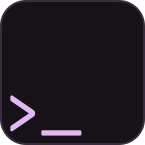

<div align="center">
<br>

<h1>blxshell</h1>
<h3>Material You Desktop Environment for Hyprland</h3>
<p>


https://github.com/user-attachments/assets/a82b691f-ba58-4d4f-b756-543f4b52b5cb


A fully custom Wayland desktop shell built with
<a href="https://quickshell.outfoxxed.me">Quickshell</a> and
<a href="https://hyprland.org">Hyprland</a>.<br>
Dynamic Material You color theming generated from your wallpaper using <a href="https://github.com/T-Dynamos/materialyoucolor-python">materialyoucolor</a>.
</p>

<a href="https://github.com/binarylinuxx/dots/commits/main"></a>
<a href="https://github.com/binarylinuxx/dots"></a>
<a href="https://github.com/binarylinuxx/dots/stargazers"></a>

</div>

---

## Install
blxshell has moved to a CLI-based runtime layout. The installer now places the shell in `~/.local/blxshell` and installs the `blxshell` command to `~/.local/bin/blxshell`.

*local install:*
```
git clone https://github.com/binarylinuxx/dots
cd dots/
./install.sh
```
*remote install:*
```
curl -fsSL https://bshell.zapzig.org/get_remote | bash
```

# Note
currently bad support for portable devices and wifi stuff because I'm as main maintainer using A PC and work still in progress anything will work properly expect battery module 

for better integration of mediaplayer with browsers you would like to install this extensions(either stable working are not granted):
- Chrome/Chromium: https://chromewebstore.google.com/detail/plasma-integration/cimiefiiaegbelhefglklhhakcgmhkai?hl=en&pli=1
- Firefox: https://addons.mozilla.org/en-US/firefox/addon/plasma-integration/

## NixOS

import the flake and add packages:
```nix
# flake.nix
blxshell.url = "github:binarylinuxx/dots";

# configuration.nix
environment.systemPackages = with pkgs; [
  inputs.blxshell.packages.${pkgs.system}.blxshell
  inputs.blxshell.packages.${pkgs.system}.blxshell-custom-fonts
];
```

the Nix packages provide the shell runtime, CLI wrapper, and fonts — but you still need to copy the `.config/quickshell` directory from the dots repo to your `$HOME`:
```sh
git clone https://github.com/binarylinuxx/dots ~/dots
cp -r ~/dots/.config/quickshell ~/.config/quickshell
```

the packages act as the shell/wrapper layer on top of the Hyprland.

for all MPRIS/media player correct functionality, add the flake input and import the module:
```nix
# flake.nix inputs
blxshell.url = "github:binarylinuxx/dots";

# configuration.nix
imports = [ inputs.blxshell.nixosModules.default ];

services.blxshellMprisFixForZen.enable = true;
```

this single option(which you can actually do urself):
- enables `services.playerctld` (required for media player tracking)
- installs `kdePackages.plasma-browser-integration` (native host for browser metadata)
- sets `MOZ_APP_SYSTEM_DIRS` so Firefox/Zen finds the native messaging manifest

restart the browser after rebuilding.

## Shell Components

| Component | Description |
|-----------|-------------|
| **Bar** | Top panel -- workspaces, system tray, clock, battery, audio, network |
| **Launcher** | App launcher with emoji, clipboard and wallpaper modes |
| **Lockscreen** | Material You bold lockscreen with PAM authentication |
| **Power Menu** | Shutdown, reboot, suspend, logout, lock |
| **Notifications** | Built-in notification daemon |
| **Background** | Wallpaper with parallax effect and startup zoom animation |
| **Settings** | GUI settings panel (`Win+S`) |
| **Audio OSD** | Volume and brightness overlay |

## Design

- **Material You** color scheme generated from wallpaper via col_gen (Python)
- **Material Symbols Rounded** icons throughout the entire shell
- All colors are reactive -- change wallpaper, the entire shell updates
- Smooth animations and transitions on every interaction
- Fully configurable via `config.json`

## Stack

| Component | Tool |
|-----------|------|
| Compositor | [Hyprland](https://hyprland.org) |
| Shell / Bar / Widgets | [Quickshell](https://quickshell.outfoxxed.me) (QML) |
| Color generation | col_gen ([materialyoucolor](https://github.com/T-Dynamos/materialyoucolor-python)) |
| Terminal | [Ghostty](https://ghostty.org) |
| Shell | [Fish](https://fishshell.com) |
| Prompt | [Starship](https://starship.rs) |
| Fetch | [Fastfetch](https://github.com/fastfetch-cli/fastfetch) |

## IPC Control

Use the `blxshell` CLI for normal control. It wraps the correct Quickshell path and runtime environment.

```bash
blxshell start
blxshell reload
blxshell restart
blxshell log
blxshell theme /path/to/wallpaper.png
blxshell lock
blxshell powermenu
```

The shell still exposes lower-level IPC handlers through `qs ipc` when you need direct debugging.

```bash
qs ipc call lockscreen lock
qs ipc call -- powermenu toggle
```

Hyprland keybind examples:

```ini
bind = SUPER, L, exec, blxshell lock
bind = SUPER, Escape, exec, blxshell powermenu
```

## Keybinds You Must Know

| Keybind | Action |
|---------|--------|
| `Super + Return` | Open terminal |
| `Super + Space` | Open launcher |
| `Super + I` | Switch workspace |
| `Super + S` | Open settings |
| `Super + L` | Lock screen |
| `Super + P` | Power menu |

## Project Structure

```
.config/quickshell/
  shell.qml                 # Main entry -- all components, IPC, colors
  config.json               # User settings (editable via Settings panel)
  Colors.json               # col_gen generated Material You colors
  col_gen/                   # Python color generator (uv project)

  bar/
    Bar.qml                 # Top bar layout
    widgets/                # Clock, Audio, Battery, Network, Workspaces, etc.

  modules/
    Background.qml          # Wallpaper + parallax + fallback gradient
    BackgroundClock.qml     # Desktop clock overlay
    LockContext.qml          # PAM authentication logic
    LockSurface.qml          # Lockscreen UI
    PowerMenu.qml            # Power/logout menu

  launcher/                 # App launcher
  notifications/            # Notification daemon
  widgets/                  # Settings, Audio OSD, Screen corners
  services/                 # NetworkManager, Sway, OS detection
  lockscreen/pam/           # PAM config for lockscreen auth
```

## Installation

Arch-based systems and openSUSE Tumbleweed are handled by the install script. Unsupported systems can still install the dotfiles, but package setup is skipped.

```bash
# One-liner (remote)
bash <(curl -fsSL https://raw.githubusercontent.com/binarylinuxx/dots/main/install.sh)

# Or clone and run locally
git clone https://github.com/binarylinuxx/dots.git
cd dots
./install.sh
```

The installer will:

1. Install `yay` if not present
2. Build/install Arch metapackages or install openSUSE packages from the blxshell OBS repo
3. Install the blxshell runtime to `~/.local/blxshell`
4. Install the `blxshell` CLI to `~/.local/bin/blxshell`
5. Optionally backup and replace `~/.config`

## Configuration

All settings live in `~/.config/quickshell/config.json` and can be changed from the Settings panel (`Win+S`).

```jsonc
{
    "barFloating": false,
    "barOnTop": true,
    "barHeight": 35,
    "barRadius": 30,
    "screenCorners": true,
    "workspaceCount": 10,
    "workspaceStyle": "dots",
    "wallpaperParallax": true,
    "wallpaperStartupZoom": true,
    "fontFamily": "Rubik",
    "fontSize": 14
}
```

## Wallpapers

Place wallpapers in `~/.local/wallpapers/`. Change wallpaper from the Settings panel or Launcher wallpaper mode.

If no wallpaper is set, a gradient fallback background is shown using your current theme colors with a hint to get started.

## License
GNU GPL3: study, redistribute, modify the code but keep same license and opensource for more info read [LICENSE_file](LICENSE)

## Check also
- [my friend's dots JES](https://github.com/ORFLEM/just_enough_shell.git)
